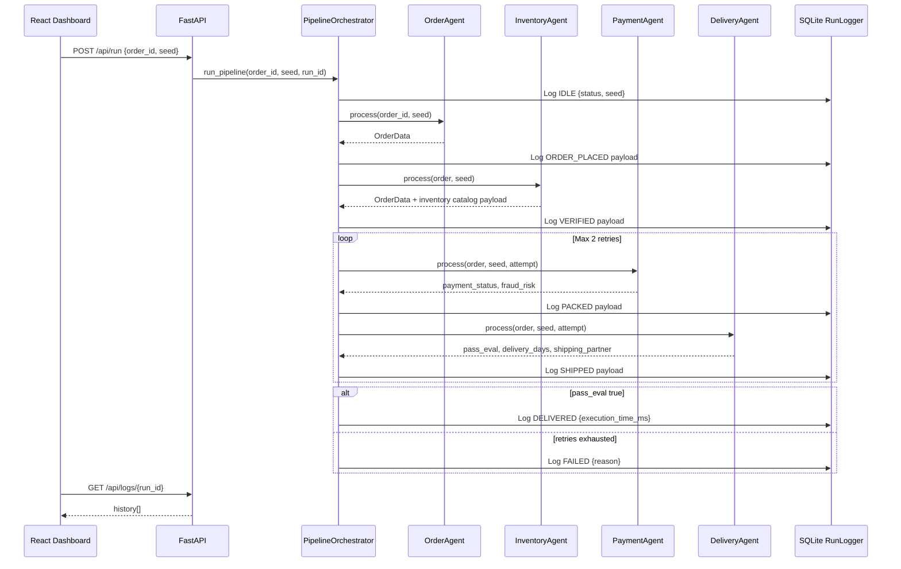

# NovaKart Multi-Agent Order Processing System

NovaKart is a deterministic multi-agent e-commerce pipeline that simulates how an order moves from checkout to delivery.

## Overview

The system uses four agents and one orchestrator:

- `OrderAgent`: builds order context from a seeded dataset input.
- `InventoryAgent`: validates stock confidence and attaches a generated catalog payload (SKU metadata, image URLs, stock labels, seasonal context).
- `PaymentAgent`: applies retry-aware payment and fraud-risk checks.
- `DeliveryAgent`: evaluates pass/fail criteria, assigns shipping partner, and estimates delivery time.
- `PipelineOrchestrator`: enforces ordered state transitions and logs protocol messages.

## State Machine

`IDLE -> ORDER_PLACED -> VERIFIED -> PACKED -> SHIPPED -> DELIVERED | FAILED`

Every transition is stored in SQLite and exposed through API logs.

## Core Features

- Deterministic runs with seed-based behavior for reproducible demos/evaluation.
- Strict state-transition orchestration.
- Structured message protocol for each stage.
- SQLite-backed run history (`runs.db`) for observability.
- React dashboard with:
  - Live stage handoffs.
  - System protocol console.
  - Inventory sheet with generated catalog context.

## Quick Start (Windows)

Use the included launcher:

```bat
start.bat
```

`start.bat` opens two terminals:

- Backend API: `python run.py`
- Frontend app: `cd demo-app && npm install && npm run dev`

## Manual Setup (Any OS)

### 1. Prerequisites

- Python 3.10+ (recommended)
- Node.js 18+ and npm

### 2. Start Backend (Port 8000)

```bash
pip install fastapi uvicorn pydantic
python run.py
```

### 3. Start Frontend (Port 5173 by default)

```bash
cd demo-app
npm install
npm run dev
```

### 4. Run a Scenario

- Open the UI in your browser (Vite URL shown in terminal, usually `http://localhost:5173`).
- Pick an order dataset ID and seed.
- Click `Process Order`.
- Track transitions, metrics, inventory context, and logs in real time.

## API Endpoints

- `POST /api/run`
  - Body: `{ "order_id": "1", "seed": 42 }`
  - Starts an asynchronous run and returns `run_id`.
- `GET /api/logs/{run_id}`
  - Returns ordered transition history for that run.
  - Query params:
    - `since_id` (optional): returns only rows with `id > since_id`.
    - `limit` (optional, default `500`): max rows per response (clamped to `1..2000`).
    - `include_payload` (optional, default `true`): when `false`, omits payload body for lighter polling.

Example:

```json
{
  "run_id": "uuid",
  "agent": "InventoryAgent",
  "state": "VERIFIED",
  "order_id": "1",
  "payload": {},
  "timestamp": "UTC datetime"
}
```

## Project Structure

- `run.py`: FastAPI entrypoint.
- `backend/`: agents, orchestrator, models, logger.
- `demo-app/`: primary React + Vite dashboard.
- `frontend/`: additional UI source (non-primary runtime app).
- `docs/`: architecture, interaction diagram, evaluation notes.
- `start.bat`: one-click Windows launcher.

## Architecture Interaction Diagram



## Project Docs

- Architecture: `docs/architecture.md`
- Interaction Diagram: `docs/interaction_diagram.md`
- Evaluation Report: `docs/evaluation_report.md`
