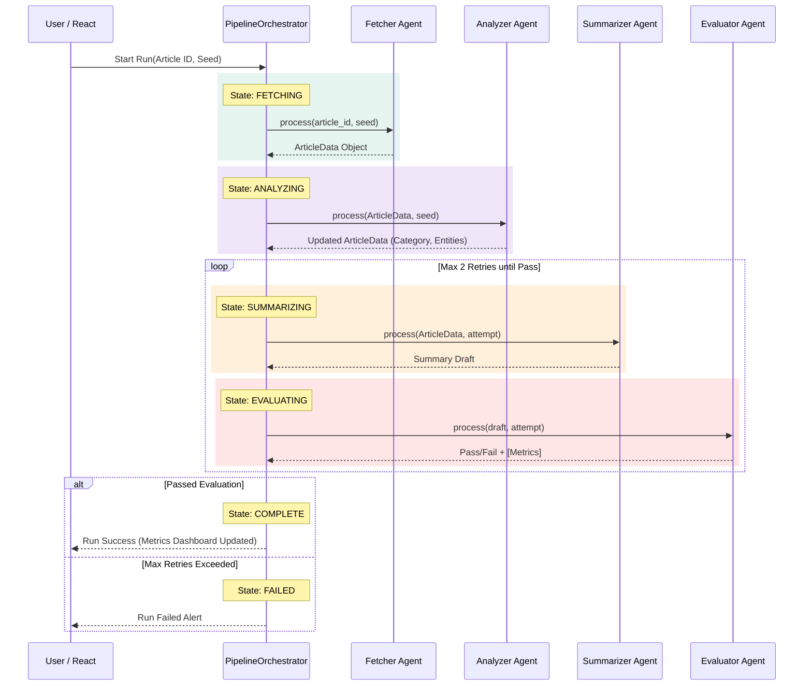

# Multi-Agent News Summarization System 🚀

A comprehensive, locally-executable Multi-Agent AI system designed to intelligently orchestrate the fetching, categorization, summarization, and quality evaluation of news articles. 

This project aims to demonstrate advanced observability, strict state machine logging, deterministic reproducibility, and concrete agent separation without resorting to monolithic "god-agent" anti-patterns.

## 🌟 Key Features

* **Real Multi-Agent Architecture**: Segregated responsibilities across 4 distinct micro-agents:
  * 📡 **FetcherAgent**: Simulates data pipeline extraction.
  * 🧠 **AnalyzerAgent**: Conducts NLP tagging (Sentiment, Entity extraction, Categorization).
  * 📝 **SummarizerAgent**: Iteratively drafts article abstracts and bullet points.
  * ⚖️ **EvaluatorAgent**: A strict referee scoring responses and recursively sending bad outputs back.
* **Deterministic Execution Engine**: Capable of strictly reproducing evaluations through Seed-based PRNG, avoiding heavy costs of API hallucination looping.
* **Visual State Machine Engine**: The `PipelineOrchestrator` regulates strict JSON messaging and stores all transition arrays locally in a strict `runs.db` database.
* **Rich Glassmorphism UI**: Native React dashboard with components displaying:
  * A live visual topology of active Pipeline Agents.
  * Explicit State Transition Trees.
  * Raw JSON Message Protocol inspection logs with MS timestamps.
  * A real-time comprehensive Quantitative Metrics board.

## 🧩 Architecture Interaction Diagram



## 🛠️ Technology Stack
* **Backend**: Python 3.10+ & FastAPI
* **Frontend**: React 18, TypeScript, Vite, Vanilla CSS
* **Storage**: SQLite Database (`runs.db`)

## 📊 Evaluation Metrics Emphasized
The system explicitly evaluates all generated output across quantitative checks:
1. **Compression Ratio Document length constraint (< 0.6)**
2. **Relevance Score Metric**
3. **Coherence Output Quality**
4. **Execution MS Runtime Tracking**

## 🚀 Getting Started

### 1. Start the Backend API
Start by getting the API and pipeline orchestrators online:
```bash
# Verify Python requires installing fastapi and uvicorn if missing
pip install fastapi uvicorn pydantic

# Run the backend execution server
python run.py
```

### 2. Start the Frontend Application
In a separate terminal, boot up the React User Interface:
```bash
cd demo-app
npm install
npm run dev
```

### 3. Usage Structure
Once booted:
* Navigate to your localized `localhost` UI mapped by the Vite runtime.
* Choose a mock Test Scenario Article ID from the dropdown.
* Fill up the target **Seed PRNG parameter**.
* Press **Start** and observe the live transition events and raw message objects mapping dynamically through to evaluation constraints!

## 📂 Deliverable Mappings
* **Architecture Docs**: See `docs/architecture.md`
* **Interaction Flow Diagram**: See `docs/interaction_diagram.md`
* **Evaluation Outputs**: See `./docs/evaluation_report.md` for a baseline comparison analysis.
