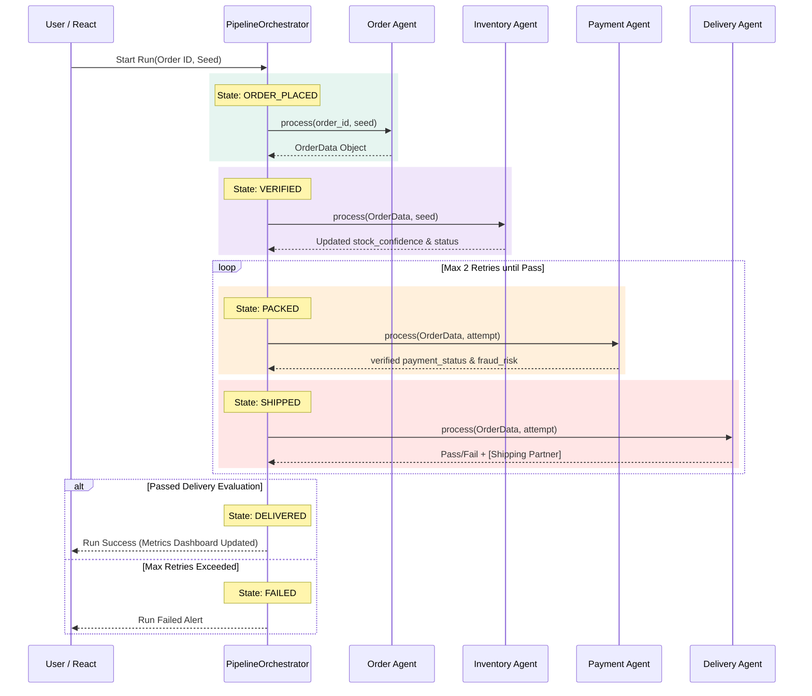

# Multi-Agent E-Commerce Order Processing System 🚀

A comprehensive, locally-executable Multi-Agent AI system designed to intelligently orchestrate the placement, inventory verification, payment authorization, and shipment assignment of e-commerce orders. 

This project aims to demonstrate advanced observability, strict state machine logging, deterministic reproducibility, and concrete agent separation without resorting to monolithic "god-agent" anti-patterns.

## 🌟 Key Features

* **Real Multi-Agent Architecture**: Segregated responsibilities across 4 distinct micro-agents:
  * 🛒 **OrderAgent**: Receives incoming customer order details.
  * 📦 **InventoryAgent**: Cross-checks and verifies inventory/stock status.
  * 💸 **PaymentAgent**: Evaluates fraud risks and handles payment verification mapping.
  * 🚚 **DeliveryAgent**: Assigns shipping partners and logs final state telemetry.
* **Deterministic Execution Engine**: Capable of strictly reproducing evaluations through Seed-based PRNG, simulating external networks realistically (like fraud systems).
* **Visual State Machine Engine**: The `PipelineOrchestrator` regulates strict JSON messaging and stores all transition arrays locally in a strict `runs.db` database.
* **Rich Glassmorphism UI**: Native React dashboard with components displaying:
  * A live visual topology of active Pipeline Agents.
  * Explicit State Transition Trees (`ORDER_PLACED -> VERIFIED -> PACKED -> SHIPPED -> DELIVERED`).
  * Raw JSON Message Protocol inspection logs with MS timestamps.
  * A real-time comprehensive Quantitative Metrics board.

## 🧩 Architecture Interaction Diagram



## 🛠️ Technology Stack
* **Backend**: Python 3.10+ & FastAPI
* **Frontend**: React 18, TypeScript, Vite, Vanilla CSS
* **Storage**: SQLite Database (`runs.db`)

## 📊 Evaluation Metrics Emphasized
The system explicitly evaluates all generated output across quantitative checks:
1. **Stock Confidence Threshold (> 0.6)**
2. **Fraud Risk Score (< 0.3)**
3. **Estimated Delivery Period Generation**
4. **Execution MS Runtime Tracking**

## 🚀 Getting Started

### 1. Start the Backend API
Start by getting the API and pipeline orchestrators online:
```bash
# Verify Python requires installing fastapi and uvicorn if missing
pip install fastapi uvicorn pydantic

# Run the backend execution server
python run.py
```

### 2. Start the Frontend Application
In a separate terminal, boot up the React User Interface:
```bash
cd demo-app
npm install
npm run dev
```

### 3. Usage Structure
Once booted:
* Navigate to your localized `localhost` UI mapped by the Vite runtime.
* Choose a mock Test Scenario Order ID from the dropdown (e.g. MacBook Pro M3).
* Fill up the target **Seed PRNG parameter**.
* Press **Start** and observe the live transition events and raw message objects mapping dynamically through to delivery constraints!

## 📂 Deliverable Mappings
* **Architecture Docs**: See `docs/architecture.md`
* **Interaction Flow Diagram**: See `docs/interaction_diagram.md`
* **Evaluation Outputs**: See `./docs/evaluation_report.md` for a baseline comparison analysis.
