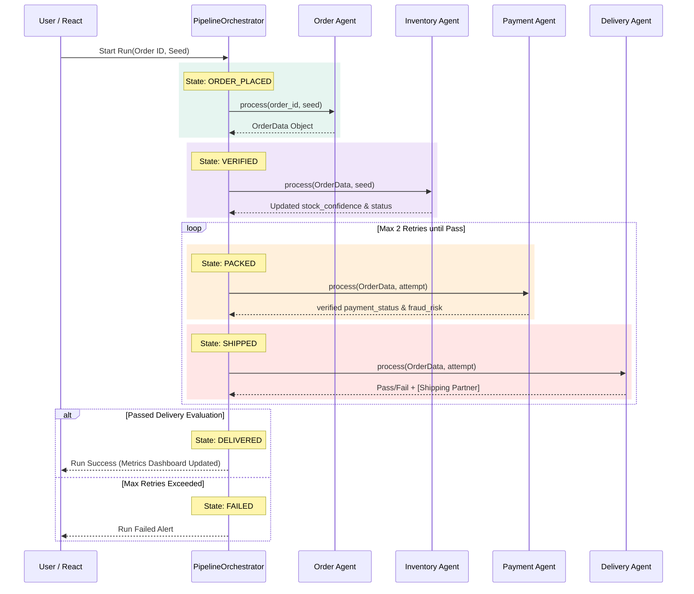

# 🛒 E-commerce Order Processing System (Multi-Agent)
📌 Overview

This system automates the complete lifecycle of an online order using multiple agents, each responsible for a specific task.
It ensures fast processing, accuracy, and scalability like real-world platforms such as Amazon and Flipkart.

🔄 State Machine (Core Requirement ✅)
Order Placed → Verified → Packed → Shipped → Delivered
State Explanation:
Order Placed → Order received
Verified → Inventory + Payment confirmed
Packed → Item prepared for shipping
Shipped → Out for delivery
Delivered → Successfully received

👉 Every transition is logged (as required in your project PDF )

🔁 Agent Interaction Flow
User → Order Agent 
      → Inventory Agent 
          → Payment Agent 
              → Delivery Agent

Each step uses structured JSON communication (no direct human intervention).

📊 Metrics (Important for Evaluation)
Order Success Rate (%)
Payment Failure Rate (%)
Delivery Time (hours/days)
Inventory Accuracy (%)

🧪 Example Scenario
User orders a mobile
Order Agent creates order
Inventory Agent confirms stock
Payment Agent verifies ₹20,000 payment
Delivery Agent assigns courier
Order delivered in 2 days

🚫 Failure Cases (Handled by System)
Out of stock → Order cancelled
Payment failed → Retry option
Delivery issue → Reassign courier

🎯 Why This Fits Your Project Requirements
✔ Multi-agent system (4 agents)
✔ Clear role separation
✔ State machine with transitions
✔ Structured communication
✔ Real-world use case
✔ Measurable metrics
✔ Can be shown in UI (agent + state panels)

🧠 Final 40-sec Explanation (Say This in Review)

"This system simulates how e-commerce platforms like Amazon process orders using multiple agents. Each agent handles a specific task such as order creation, stock checking, payment verification, and delivery assignment. A state machine controls the flow from order placement to delivery, ensuring transparency and reliability. All interactions are logged and measurable, making the system scalable and efficient."

## 🧩 Architecture Interaction Diagram



## 🛠️ Technology Stack
* **Backend**: Python 3.10+ & FastAPI
* **Frontend**: React 18, TypeScript, Vite, Vanilla CSS
* **Storage**: SQLite Database (`runs.db`)

## 📊 Evaluation Metrics Emphasized
The system explicitly evaluates all generated output across quantitative checks:
1. **Stock Confidence Threshold (> 0.6)**
2. **Fraud Risk Score (< 0.3)**
3. **Estimated Delivery Period Generation**
4. **Execution MS Runtime Tracking**

## 🚀 Getting Started

### 1. Start the Backend API
Start by getting the API and pipeline orchestrators online:
```bash
# Verify Python requires installing fastapi and uvicorn if missing
pip install fastapi uvicorn pydantic

# Run the backend execution server
python run.py
```

### 2. Start the Frontend Application
In a separate terminal, boot up the React User Interface:
```bash
cd demo-app
npm install
npm run dev
```

### 3. Usage Structure
Once booted:
* Navigate to your localized `localhost` UI mapped by the Vite runtime.
* Choose a mock Test Scenario Order ID from the dropdown (e.g. MacBook Pro M3).
* Fill up the target **Seed PRNG parameter**.
* Press **Start** and observe the live transition events and raw message objects mapping dynamically through to delivery constraints!

## 📂 Deliverable Mappings
* **Architecture Docs**: See `docs/architecture.md`
* **Interaction Flow Diagram**: See `docs/interaction_diagram.md`
* **Evaluation Outputs**: See `./docs/evaluation_report.md` for a baseline comparison analysis.
