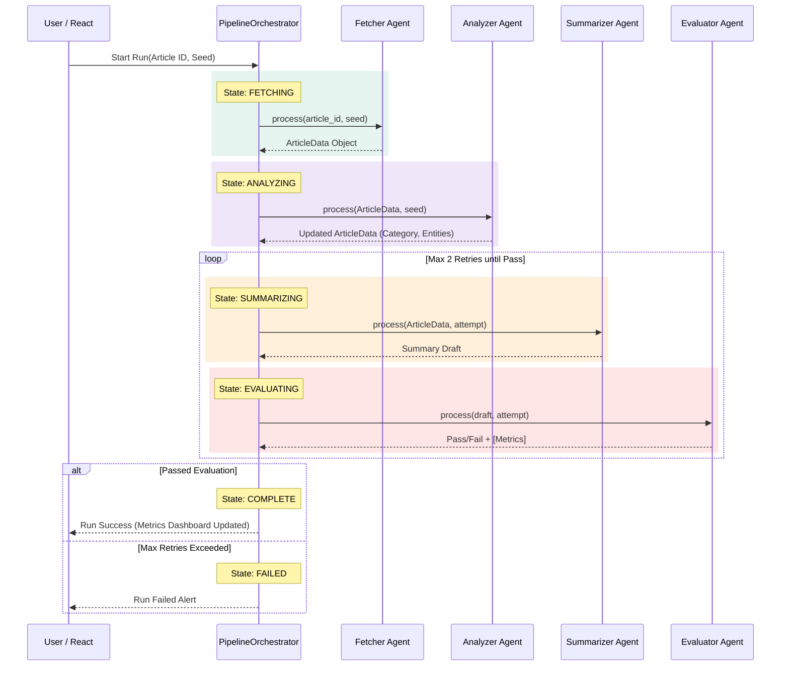

# Multi-Agent News Summarizer Interaction Diagram

```mermaid
sequenceDiagram
    participant UI as User / React
    participant Orch as PipelineOrchestrator
    participant Fetcher as Fetcher Agent
    participant Analyzer as Analyzer Agent
    participant Summarizer as Summarizer Agent
    participant Evaluator as Evaluator Agent

    UI->>Orch: Start Run(Article ID, Seed)
    
    rect rgb(230, 245, 240)
    Note over Orch: State: FETCHING
    Orch->>Fetcher: process(article_id, seed)
    Fetcher-->>Orch: ArticleData Object
    end

    rect rgb(240, 230, 250)
    Note over Orch: State: ANALYZING
    Orch->>Analyzer: process(ArticleData, seed)
    Analyzer-->>Orch: Updated ArticleData (Category, Entities)
    end

    loop Max 2 Retries until Pass
        rect rgb(255, 240, 220)
        Note over Orch: State: SUMMARIZING
        Orch->>Summarizer: process(ArticleData, attempt)
        Summarizer-->>Orch: Summary Draft
        end

        rect rgb(255, 230, 230)
        Note over Orch: State: EVALUATING
        Orch->>Evaluator: process(draft, attempt)
        Evaluator-->>Orch: Pass/Fail + [Metrics]
        end
    end

    alt Passed Evaluation
        Note over Orch: State: COMPLETE
        Orch-->>UI: Run Success (Metrics Dashboard Updated)
    else Max Retries Exceeded
        Note over Orch: State: FAILED
        Orch-->>UI: Run Failed Alert
    end
```
