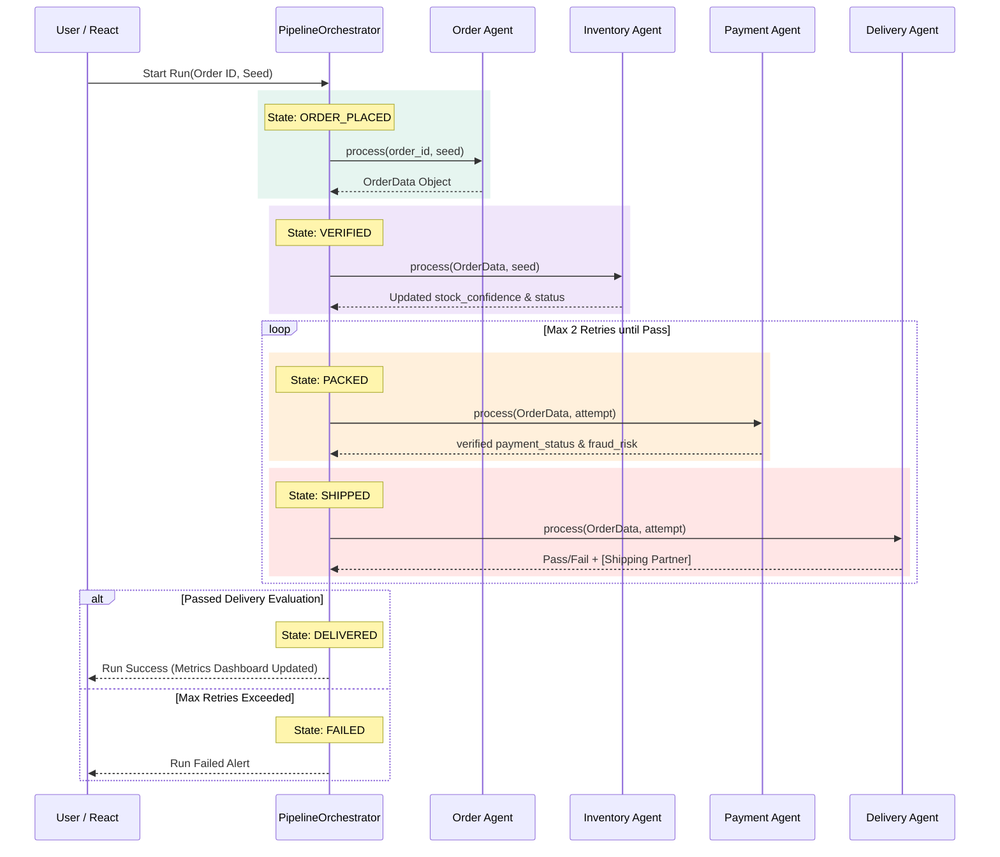

# Multi-Agent E-Commerce Interaction Diagram

```mermaid
sequenceDiagram
    participant UI as User / React
    participant Orch as PipelineOrchestrator
    participant OrderA as Order Agent
    participant InvA as Inventory Agent
    participant PayA as Payment Agent
    participant DelA as Delivery Agent

    UI->>Orch: Start Run(Order ID, Seed)
    
    rect rgb(230, 245, 240)
    Note over Orch: State: ORDER_PLACED
    Orch->>OrderA: process(order_id, seed)
    OrderA-->>Orch: OrderData Object
    end

    rect rgb(240, 230, 250)
    Note over Orch: State: VERIFIED
    Orch->>InvA: process(OrderData, seed)
    InvA-->>Orch: Updated stock_confidence & status
    end

    loop Max 2 Retries until Pass
        rect rgb(255, 240, 220)
        Note over Orch: State: PACKED
        Orch->>PayA: process(OrderData, attempt)
        PayA-->>Orch: verified payment_status & fraud_risk
        end

        rect rgb(255, 230, 230)
        Note over Orch: State: SHIPPED
        Orch->>DelA: process(OrderData, attempt)
        DelA-->>Orch: Pass/Fail + [Shipping Partner]
        end
    end

    alt Passed Delivery Evaluation
        Note over Orch: State: DELIVERED
        Orch-->>UI: Run Success (Metrics Dashboard Updated)
    else Max Retries Exceeded
        Note over Orch: State: FAILED
        Orch-->>UI: Run Failed Alert
    end
```
